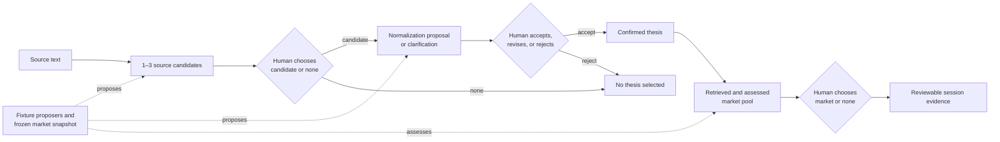

# FitCheck — an Epistemic Ledger reference

Epistemic Ledger is an agent-first project for helping people keep testable
theses connected to their source material, evidence, and explicit human
decisions over time. FitCheck is its first, deliberately narrow application:
assessing whether a prediction-market contract expresses an event-risk thesis.

FitCheck is evidence-first, not trade-first. It does not execute trades,
custody assets, recommend position sizes, or turn a weak proxy into a clean
expression. For example, a contract may capture an event's outcome while
missing the thesis's time horizon or target population; FitCheck should show
that mismatch rather than call it a clean expression. `no_clean_expression` is
a valid result only for the exact, non-empty, fully assessed displayed pool.

## Product direction and public boundary

The product direction is to let a person turn source material into a
decision-ready, testable thesis, explicitly confirm its meaning, inspect
supporting and counterevidence, state disconfirming or revisit conditions, and
retain a human-owned history of revisions. Prediction markets are the first
expression surface, not a claim that every important thesis has a tradable
expression. FitCheck asks whether a checked contract is useful and explains
what it captures and misses; a market price does not establish that a thesis is
true.

Agents may eventually prepare bounded, provenance-linked work for that
process. They do not own thesis meaning, confidence, commitment, or semantic
review decisions. The intended source-selection and confirmation interaction
is recorded in the [v3.1 UI contract](docs/fitcheck-v3.1-ui-contract.md).

The local v3.1 UI provides a synchronous, offline fixture path: source
interpretation, explicit candidate-or-`none` choice, normalization
confirmation, an assessed market pool, and market-or-`none` choice. The MCP
source path uses separate submission and worker processes, as described below.
Legacy predecessor routes remain available for compatibility and are not the
default journey.

This reference does not ship a general thesis ledger, ongoing monitoring,
generic venture discovery, a production service, or a verified third-party
agent client. Offline tests can establish declared contracts; they cannot
establish semantic accuracy or user value. A generic-Gemini versus
complete-FitCheck normalization comparison requires the same cases and model,
followed by stage-specific blinded human review. It must not turn private
evaluation evidence, live-provider access, or a design direction into a public
product claim.

## System at a glance



Models and providers can propose evidence; they do not own durable truth.
Deterministic checks preserve declared policy, schema, provenance, and
bookkeeping; they do not establish semantic truth. The fixture UI executes the
diagrammed journey synchronously. Durable worker and snapshot foundations are
separate, tested components; the fixture UI does not represent an asynchronous
or live-provider workflow.

## Engineering evidence

| Claim | Implementation | Verification |
| --- | --- | --- |
| Background work has durable identity, idempotent submission, bounded retries, cancellation, leases, and stale-worker fencing. | [`el/jobs/store.py`](el/jobs/store.py) and the [worker schema migration](migrations/versions/a4d8c2e6f0b1_worker_job_snapshot_foundation.py) | [`tests/test_job_store.py`](tests/test_job_store.py) plus the real [`PostgreSQL contention gate`](tests/test_job_store_postgres.py) |
| A market-universe refresh is validated before promotion, with content identity separate from the active pointer. | [`el/retrieval/snapshot_worker.py`](el/retrieval/snapshot_worker.py), [`snapshot_validation.py`](el/retrieval/snapshot_validation.py), and [`snapshot_store.py`](el/retrieval/snapshot_store.py) | [`tests/test_snapshot_worker.py`](tests/test_snapshot_worker.py) |
| Classification binds a job to snapshot, index, policy, prompt, and model identities before applying a deterministic fit-policy result. | [`el/classification/worker.py`](el/classification/worker.py) and [`planner.py`](el/classification/planner.py) | [`tests/test_classification_worker.py`](tests/test_classification_worker.py) |
| The predecessor fit policy applies deterministic checks rather than accepting a model response unexamined. | [`el/fitgate/service.py`](el/fitgate/service.py), [`checks.py`](el/fitgate/checks.py), and [`policy.py`](el/fitgate/policy.py) | [`tests/test_fit_service.py`](tests/test_fit_service.py) and [`tests/test_fitgate_checks.py`](tests/test_fitgate_checks.py). These checks are declared policy mechanics, not an independent semantic authority. |
| A user correction creates review work without silently rewriting cards, decisions, or ledger truth. | [`el/product/api.py`](el/product/api.py) and [`el/review/candidates.py`](el/review/candidates.py) | [`tests/test_correction_loop.py`](tests/test_correction_loop.py) and [`tests/test_review_candidates.py`](tests/test_review_candidates.py) |
| Authenticated MCP tool invocations consume bounded, per-key weighted usage across instances before tool execution. | [`el/mcp/rate_limit.py`](el/mcp/rate_limit.py) and [`el/domain/tables.py`](el/domain/tables.py) | [`tests/test_mcp_rate_limit.py`](tests/test_mcp_rate_limit.py) and the [PostgreSQL contention gate](tests/test_job_store_postgres.py) |
| The public artifact is generated from an allowlist and fails closed on unexpected files, live identifiers, secrets, and private roots. | [`scripts/build_public_export.py`](scripts/build_public_export.py) and [`scripts/check_public_boundary.py`](scripts/check_public_boundary.py) | [`tests/test_public_export.py`](tests/test_public_export.py), [`tests/test_public_boundary.py`](tests/test_public_boundary.py), and the [public CI gates](.github/workflows/ci.yml) |

For the architectural reasoning, ownership boundaries, tradeoffs, and failure
handling behind those links, see the
[`engineering walkthrough`](docs/engineering-walkthrough.md).

## Implementation status

| Surface | Status | Boundary |
| --- | --- | --- |
| v3.1 source -> selected candidate -> confirmed thesis -> market-pool -> market-or-none fixture journey | **Public, offline fixture reference** | Synchronous local SQLite flow using project-authored synthetic source and frozen market fixtures. It makes no live provider or model call. |
| Legacy predecessor classify, blind-prior, draft, and simple-ledger routes | **Public compatibility reference** | Retained for replay and compatibility; they are not the default v3.1 journey. |
| Durable jobs, classification worker, and snapshot validation | **Public, separately tested foundations** | The fixture UI does not use these as an asynchronous workflow. The MCP source-interpretation protocol reuses a bounded fixture worker separately. Public CI adds a disposable PostgreSQL contention gate. |
| Deterministic fit policies, correction intake, review queue, and MCP contracts | **Public, offline fixture reference** | MCP source interpretation submits, runs, and polls a bounded fixture job; that is distinct from the synchronous UI path. SQL-backed per-key admission applies. Synthetic tests establish declared contracts, not live-data accuracy, production readiness, or a verified external client. |
| Cloud, provider, and operational runtime | **Not attested by this public repository** | Service identifiers, infrastructure configuration, database, credentials, and current operational evidence are excluded. |
| Live PolyData retrieval source and provider operations | **Excluded** | Provider implementation, credentials, payloads, retry policy, and authorization are absent; live-provider selection fails closed. |
| Governed review corpus and reported evaluation rows | **Private** | Public fixtures are regression material, not the governed benchmark or evidence for external validity. |
| Trade execution, wallets, custody, and brokerage integration | **Out of scope** | FitCheck evaluates expression quality; it does not execute or advise trades. |

## What this public distribution contains

This repository is an offline-runnable and credential-free-by-default
distribution of the core domain services, deterministic policy gates, worker
contracts, local product surface, and a selected offline test suite. After
dependencies are installed, fixture-mode tests and the local product flow make
no network or model calls. The included fixture data is project-authored
synthetic material with fabricated or neutralized identifiers for public
regression testing; it is not a market feed, governed review corpus, or
production evaluation corpus.

The authoritative governed review corpus remains private. It contains review
provenance and source material whose redistribution rights and privacy
boundaries differ from those of the source code. Public experiment reports may
summarize governed measurements without publishing the underlying rows. See
the [`July 2026 reviewed-data measurement summary`](docs/experiments/README.md)
for the observed limitations and negative results.

The retrieval layer exposes a provider protocol, but this distribution ships
only `FixtureMarketProvider`. Live provider implementations, credentials,
payloads, retry policy, and operational configuration are absent.
`MARKET_PROVIDER=polydata` deliberately fails closed. Offline fixture mode
does not make network or model calls.

Any separately operated reference service is outside this public artifact. Its
service identifiers, database, secrets, deployment configuration, and current
operational state are not published here. The Docker image in this repository
runs the local fixture UI; it is not a reference deployment image.

## Quick start: v3.1 synchronous fixture reference

Python 3.12 or newer is required.

```bash
python3.12 -m venv .venv
.venv/bin/python -m pip install -e ".[dev]"
PYTHONPATH=. .venv/bin/python -m pytest \
  tests/test_v3_reference_flow.py \
  tests/test_v3_async_source_jobs.py \
  tests/test_mcp_v3_fixture_ownership.py \
  tests/test_mcp_v3_worker_bootstrap.py \
  tests/test_mcp_v3_stdio_smoke.py \
  tests/test_public_v31_security.py
```

The focused v3.1 command passes without a provider or model call. Run the
broader offline suite separately after dependency installation:

```bash
.venv/bin/python -m pytest --ignore=tests/test_job_store_postgres.py
```

Run the local fixture UI:

```bash
PYTHONDONTWRITEBYTECODE=1 PYTHONPATH=. \
FITCHECK_UI_MODE=fixture \
FITCHECK_UI_DB_URL=sqlite:////tmp/fitcheck-v31-fixture.db \
.venv/bin/uvicorn el.product.app:app \
  --host 127.0.0.1 --port 8100
```

Open `http://127.0.0.1:8100`. Select **Load synthetic two-thesis fixture** to replay one
project-authored fictional source with two candidate theses, then choose one,
answer its fixture clarification, accept the resulting proposal, and inspect
the market pool. The app uses a local SQLite database and frozen synthetic
fixtures. It needs no cloud account, provider credential, or model credential.
Use a distinct disposable SQLite path for each fixture run. `FITCHECK_UI_DB_URL`
is deliberately for the synchronous UI only; do not reuse it for MCP jobs.

### MCP fixture-worker checkpoint

The MCP source-interpretation protocol is separate from the UI. The canonical
offline end-to-end smoke is:

```bash
PYTHONDONTWRITEBYTECODE=1 PYTHONPATH=. \
.venv/bin/python -m pytest tests/test_mcp_v3_stdio_smoke.py
```

It opens an SDK stdio session, submits a fixture v3 source job, runs a separate
worker process, and polls through a new stdio session. For a manually submitted
fixture MCP job, migrate and use that same MCP database with no
`FITCHECK_UI_DB_URL` override:

```bash
FITCHECK_DB_URL=sqlite+pysqlite:////tmp/fitcheck-v31-mcp.db \
.venv/bin/python -m alembic upgrade head
FITCHECK_DB_URL=sqlite+pysqlite:////tmp/fitcheck-v31-mcp.db \
PYTHONDONTWRITEBYTECODE=1 PYTHONPATH=. \
.venv/bin/python -m el.sourceinterpretation.worker --surface mcp-fixture --once
```

Do not treat the worker invocation as a deployed service or named-client
integration.

## Containerized fixture UI

```bash
docker build -t fitcheck-fixture .
docker run --rm -p 127.0.0.1:8080:8080 fitcheck-fixture
```

Then open `http://127.0.0.1:8080`. Keep the host-side port bound to loopback:
the fixture API is a single-user, unauthenticated local surface. Do not treat
this container as a production authentication or deployment reference.

## Optional PostgreSQL contention test

The public CI workflow runs `tests/test_job_store_postgres.py` against a
temporary PostgreSQL 16 service. Locally, set `FITCHECK_POSTGRES_TEST_URL` to a
disposable test database before running that module. Never point the test at a
shared or production database.

## Design tradeoffs and failure modes

- Deterministic checks make declared policy inspectable. Their semantic
  effectiveness requires separate evaluation and human review; the published
  July experiments document limitations of the predecessor policy.
- Frozen snapshots preserve provenance and testability at the cost of
  freshness. The active pointer moves only after validation; a same-cutoff
  content conflict stops for operator review.
- A durable job ledger handles duplicate delivery, transient failure, lease
  expiry, cancellation, and retry exhaustion. It cannot make an unauthorized
  or unavailable provider succeed.
- Corrections are intentionally slower than direct mutation: they mint
  review candidates so a user disagreement cannot silently become evaluation
  truth.
- The public export favors a narrow, inspectable surface over mirroring the
  private repository. Contributions must be ported deliberately through the
  private review and re-export process.

## Honest limitations

- The public fixtures are small, synthetic, and non-representative. Passing
  them does not establish real-world retrieval recall, classification accuracy,
  calibration, or market coverage.
- The live provider source and the reference deployment configuration are not
  included, so this repository cannot reproduce live retrieval or attest the
  private service's operational state.
- Dependency ranges are declared in `pyproject.toml`, but this distribution
  does not include an exact resolved dependency lock. It therefore claims an
  offline-runnable, credential-free fixture path—not byte-for-byte environment
  reproduction.
- The fixture UI is a local single-user surface and is not an authentication,
  tenancy, metering, migration, or internet-exposure reference.

## Trust boundaries

- Models and live providers may propose evidence; deterministic gates and
  human review govern durable truth.
- Frozen fixtures are offline test truth. Live retrieval must not silently
  rewrite governed labels.
- Corrections create review candidates; they do not directly mutate goldens or
  ledger truth.
- Execution, wallets, custody, and brokerage integrations are out of scope.

See [`DATA_CARD.md`](DATA_CARD.md) for fixture limitations,
[`PUBLIC_REPO_BOUNDARY.md`](PUBLIC_REPO_BOUNDARY.md) for the export contract,
and [`SECURITY.md`](SECURITY.md) for private vulnerability reporting.

## License

The code, documentation, and project-authored synthetic fixtures in this
public distribution are licensed under the
[Apache License 2.0](LICENSE). Private governed data, provider material, and
other excluded artifacts are not part of this distribution or this license
grant.
