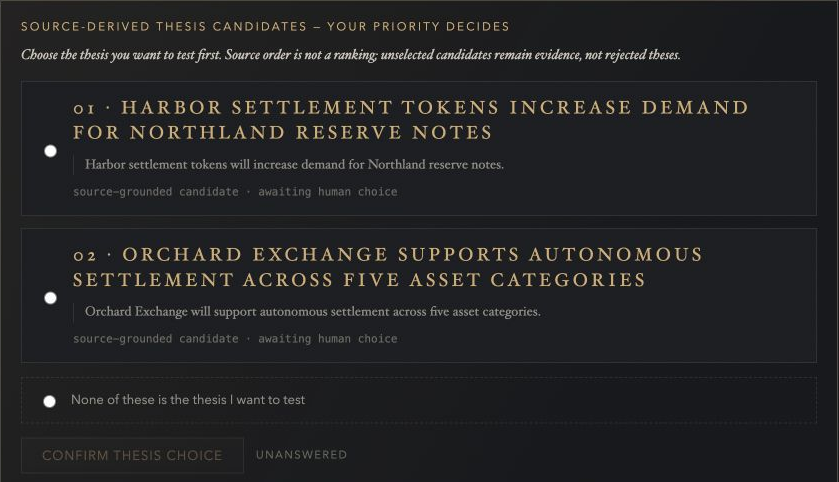
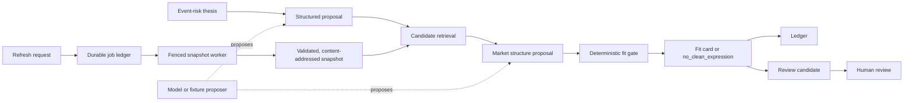

# FitCheck

FitCheck evaluates whether a prediction-market contract cleanly expresses an
event-risk thesis. It structures a thesis, retrieves candidate contracts,
classifies expression quality, explains what each candidate captures or
misses, and records reviewable evidence.

FitCheck is ledger-first, not trade-first. It does not execute trades, custody
assets, recommend position sizes, or turn a weak proxy into a clean expression.
`no_clean_expression` is a valid result.



## System at a glance



Models and providers can propose evidence; they do not own durable truth. The
public fixture UI exercises the thesis-to-fit-card-to-ledger loop locally. The
job and snapshot path is a separately implemented and tested worker boundary;
the public fixture UI does not pretend to exercise an excluded live provider.

## Engineering evidence

| Claim | Implementation | Verification |
| --- | --- | --- |
| Background work has durable identity, idempotent submission, bounded retries, cancellation, leases, and stale-worker fencing. | [`el/jobs/store.py`](el/jobs/store.py) and the [worker schema migration](migrations/versions/a4d8c2e6f0b1_worker_job_snapshot_foundation.py) | [`tests/test_job_store.py`](tests/test_job_store.py) plus the real [`PostgreSQL contention gate`](tests/test_job_store_postgres.py) |
| A market-universe refresh is validated before promotion, with content identity separate from the active pointer. | [`el/retrieval/snapshot_worker.py`](el/retrieval/snapshot_worker.py), [`snapshot_validation.py`](el/retrieval/snapshot_validation.py), and [`snapshot_store.py`](el/retrieval/snapshot_store.py) | [`tests/test_snapshot_worker.py`](tests/test_snapshot_worker.py) |
| Classification binds a job to snapshot, index, policy, prompt, and model identities before executing a deterministic final fit decision. | [`el/classification/worker.py`](el/classification/worker.py) and [`planner.py`](el/classification/planner.py) | [`tests/test_classification_worker.py`](tests/test_classification_worker.py) |
| Expression quality is governed by deterministic policy rather than accepted from a model response. | [`el/fitgate/service.py`](el/fitgate/service.py), [`checks.py`](el/fitgate/checks.py), and [`policy.py`](el/fitgate/policy.py) | [`tests/test_fit_service.py`](tests/test_fit_service.py) and [`tests/test_fitgate_checks.py`](tests/test_fitgate_checks.py) |
| A user correction creates review work without silently rewriting cards, decisions, or ledger truth. | [`el/product/api.py`](el/product/api.py) and [`el/review/candidates.py`](el/review/candidates.py) | [`tests/test_correction_loop.py`](tests/test_correction_loop.py) and [`tests/test_review_candidates.py`](tests/test_review_candidates.py) |
| The public artifact is generated from an allowlist and fails closed on unexpected files, live identifiers, secrets, and private roots. | [`scripts/build_public_export.py`](scripts/build_public_export.py) and [`scripts/check_public_boundary.py`](scripts/check_public_boundary.py) | [`tests/test_public_export.py`](tests/test_public_export.py), [`tests/test_public_boundary.py`](tests/test_public_boundary.py), and the [public CI gates](.github/workflows/ci.yml) |

For the architectural reasoning, ownership boundaries, tradeoffs, and failure
handling behind those links, see the
[`engineering walkthrough`](docs/engineering-walkthrough.md).

## Implementation status

| Surface | Status | Boundary |
| --- | --- | --- |
| Fixture thesis -> fit card -> ledger product loop | **Public, implemented, and offline-tested** | Uses authored synthetic fixtures and a local SQLite database; no live provider or model call is implied. |
| Durable jobs, classification worker, snapshot validation, and promotion primitives | **Public, implemented, and tested** | SQLite covers state-machine behavior; public CI adds a disposable PostgreSQL contention gate. The fixture UI remains a synchronous local slice. |
| Deterministic fit policies, correction intake, review queue, and MCP contracts | **Public, implemented, and tested** | Synthetic tests establish declared contracts, not live-data accuracy or production readiness. |
| Reference Cloud Run, Vertex AI, and Cloud SQL service | **Private reference deployment** | The deployment is operated separately. Service identifiers, infrastructure configuration, database, and operational evidence are not public artifacts. |
| Live PolyData retrieval source and provider operations | **Excluded** | Provider implementation, credentials, payloads, retry policy, and authorization are absent; live-provider selection fails closed. |
| Governed review corpus and reported evaluation rows | **Private** | Public fixtures are regression material, not the governed benchmark or evidence for external validity. |
| Trade execution, wallets, custody, and brokerage integration | **Out of scope** | FitCheck evaluates expression quality; it does not execute or advise trades. |

## What this public distribution contains

This repository is an offline-runnable and credential-free-by-default
distribution of the core domain services, deterministic policy gates, worker
contracts, local product surface, and a selected offline test suite. After
dependencies are installed, fixture-mode tests and the local product flow make
no network or model calls. The included fixture data is project-authored
synthetic material with fabricated or neutralized identifiers for public
regression testing; it is not a market feed, governed review corpus, or
production evaluation corpus.

The authoritative governed review corpus remains private. It contains review
provenance and source material whose redistribution rights and privacy
boundaries differ from those of the source code. Public experiment reports may
summarize governed measurements without publishing the underlying rows. See
the [`July 2026 reviewed-data measurement summary`](docs/experiments/README.md)
for the observed limitations and negative results.

The retrieval layer exposes a provider protocol, but this distribution ships
only `FixtureMarketProvider`. Live provider implementations, credentials,
payloads, retry policy, and operational configuration are absent.
`MARKET_PROVIDER=polydata` deliberately fails closed. Offline fixture mode
does not make network or model calls.

A reference service is deployed separately on an IAM-private Cloud Run
surface, with Vertex AI and Cloud SQL behind a dedicated runtime identity. Its
service identifiers, database, secrets, and deployment configuration are not
published here. The Docker image in this repository runs the local fixture UI;
it is not the reference deployment image.

## Quick start: offline fixture mode

Python 3.12 or newer is required.

```bash
python3.12 -m venv .venv
.venv/bin/python -m pip install -e ".[dev]"
.venv/bin/python -m pytest --ignore=tests/test_job_store_postgres.py
```

Run the local fixture UI:

```bash
FITCHECK_UI_MODE=fixture .venv/bin/python -m uvicorn el.product.app:app \
  --host 127.0.0.1 --port 8100
```

Open `http://127.0.0.1:8100`. The app uses a local SQLite database, four
synthetic thesis proposals, and a ten-contract synthetic snapshot. It needs no
cloud account, provider credential, or model credential.

## Containerized fixture UI

```bash
docker build -t fitcheck-fixture .
docker run --rm -p 8080:8080 fitcheck-fixture
```

Then open `http://127.0.0.1:8080`. Do not treat this fixture container as a
production authentication or deployment reference.

## Optional PostgreSQL contention test

The public CI workflow runs `tests/test_job_store_postgres.py` against a
temporary PostgreSQL 16 service. Locally, set `FITCHECK_POSTGRES_TEST_URL` to a
disposable test database before running that module. Never point the test at a
shared or production database.

## Design tradeoffs and failure modes

- Deterministic gates improve inspectability and constrain false-positive
  expression claims, but rules require governed review and deliberate version
  changes as language and contract forms evolve.
- Frozen snapshots preserve provenance and testability at the cost of
  freshness. The active pointer moves only after validation; a same-cutoff
  content conflict stops for operator review.
- A durable job ledger handles duplicate delivery, transient failure, lease
  expiry, cancellation, and retry exhaustion. It cannot make an unauthorized
  or unavailable provider succeed.
- Corrections are intentionally slower than direct mutation: they mint
  review candidates so a user disagreement cannot silently become evaluation
  truth.
- The public export favors a narrow, inspectable surface over mirroring the
  private repository. Contributions must be ported deliberately through the
  private review and re-export process.

## Honest limitations

- The public fixtures are small, synthetic, and non-representative. Passing
  them does not establish real-world retrieval recall, classification accuracy,
  calibration, or market coverage.
- The live provider source and the reference deployment configuration are not
  included, so this repository cannot reproduce live retrieval or attest the
  private service's operational state.
- Dependency ranges are declared in `pyproject.toml`, but this distribution
  does not include an exact resolved dependency lock. It therefore claims an
  offline-runnable, credential-free fixture path—not byte-for-byte environment
  reproduction.
- The fixture UI is a local single-user surface and is not an authentication,
  tenancy, metering, migration, or internet-exposure reference.

## Trust boundaries

- Models and live providers may propose evidence; deterministic gates and
  human review govern durable truth.
- Frozen fixtures are offline test truth. Live retrieval must not silently
  rewrite governed labels.
- Corrections create review candidates; they do not directly mutate goldens or
  ledger truth.
- Execution, wallets, custody, and brokerage integrations are out of scope.

See [`DATA_CARD.md`](DATA_CARD.md) for fixture limitations,
[`PUBLIC_REPO_BOUNDARY.md`](PUBLIC_REPO_BOUNDARY.md) for the export contract,
and [`SECURITY.md`](SECURITY.md) for private vulnerability reporting.

## License

The code, documentation, and project-authored synthetic fixtures in this
public distribution are licensed under the
[Apache License 2.0](LICENSE). Private governed data, provider material, and
other excluded artifacts are not part of this distribution or this license
grant.
